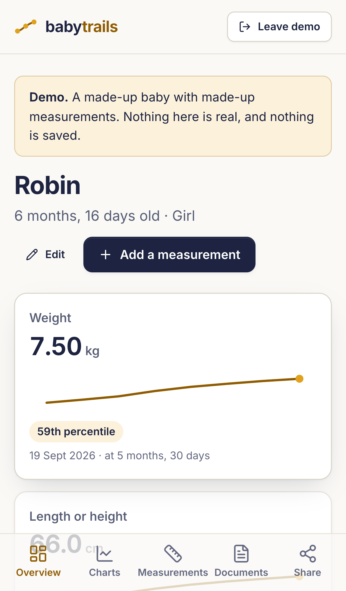
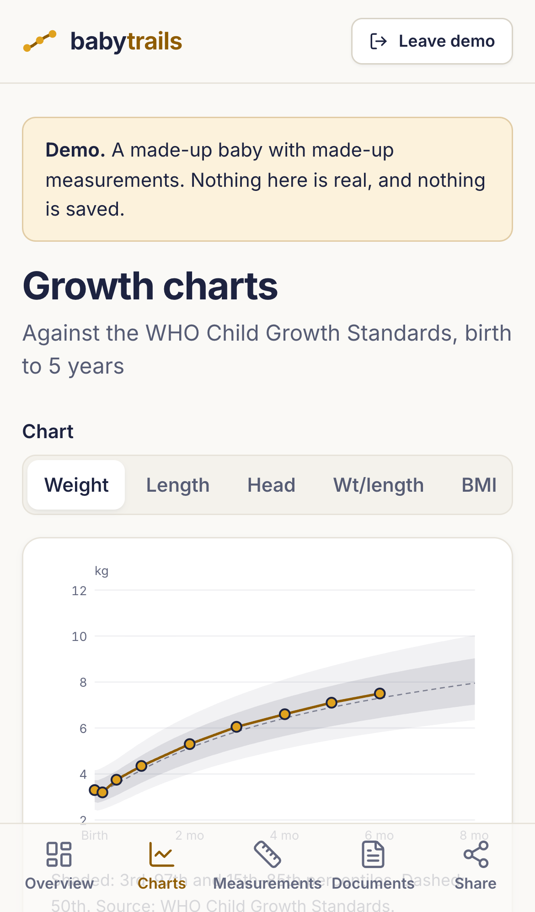
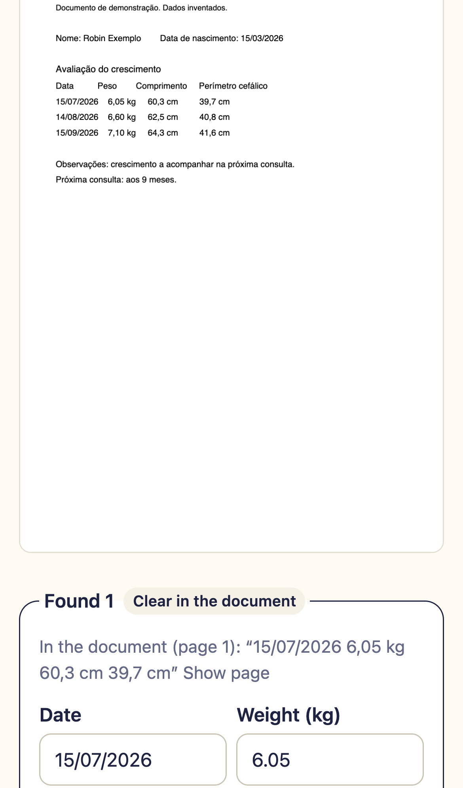

# BabyTrails

**Your baby's growth records, private and in one place.** Keep your baby's measurements on the WHO
growth charts, store their growth reports, health booklet pages, doctor's notes and ultrasound
images, and get plain-language summaries of what's changed.

**Free and open source** (MIT licence). Website: [babytrails.app](https://babytrails.app). There's
no account, no sign-up, no ads and no tracking. Everything you enter stays encrypted on your device.
If you choose to use an AI feature, your browser sends that one request straight to the AI provider,
with your own key.

  
  
  

*Screenshots show the demo, with a made-up baby and made-up data.*

## What it does

- **WHO growth charts.** Weight, length or height, head circumference, weight for length and BMI,
  from birth to 5 years, with the percentile bands paediatricians use. BabyTrails works out the
  percentiles itself, with the WHO's own method.
- **The first weeks.** Birth weight, how much was lost in the first days and when it was regained,
  with charts in weeks for the first three months.
- **Gain over time.** Grams a week (or ounces) between every pair of weighings, and centimetres a
  month for length and head, each next to the gain that would have kept the same percentile, and,
  when the dates line up, compared with WHO's standards for weight gain at that age.
- **Quick entry at the doctor's.** Type the numbers on your phone; you see the percentile as you
  type. Metric or imperial, and "7,25" works as well as "7.25".
- **A second look at odd numbers.** A value far off the chart, or a length smaller than last time,
  gets a gentle "measure again?". Record whether it was measured at home, and leave out a
  measurement you doubt without deleting it.
- **Documents in one place.** Add PDFs and photos of growth reports, health booklet pages, doctor's
  notes and ultrasound images, several at once or in a zip. Files you've already added are spotted.
  They're stored encrypted and open in the app.
- **Read a growth report for you (optional, AI).** BabyTrails can ask the AI to find the
  measurements in a report or booklet page, including Portuguese ones. You check every value next
  to the page before anything is saved.
- **Plain-language summaries (optional, AI).** "What changed" since the last check-up, and questions
  to ask at the next one. BabyTrails calculates the numbers; the AI only puts them into words.
  Doctor's notes can be summarised too.
- **Ask about the numbers (optional, AI).** "Is this a usual weight gain?", "What does the 59th
  percentile mean?": answers explain the numbers BabyTrails worked out, and every number in an
  answer is checked against your records before you see it. Conversations are saved, encrypted.
- **A report card to share.** The latest numbers with percentiles, four WHO charts, gain over time
  and the history, as a phone-sized image or an A4 PDF. You choose whether it shows the name, a
  nickname or no name. A simple one-page report is still there too.
- **Works offline** once you've opened it, and can be installed like an app.

## Try it

Open [babytrails.app](https://babytrails.app) and tap **Try the demo**. It shows a made-up baby; you
don't need a passphrase or a key, and nothing you do in the demo is saved.

## Start using it

1. Open [babytrails.app](https://babytrails.app) and tap **Set up your vault**.
2. Choose a passphrase. Four or more random words are strong and easy to type.
   **There's no way to reset it.** If you forget it, your records can't be recovered, by anyone.
3. Add your baby, then add a measurement.
4. **Add it to your home screen** (on iPhone: Safari's Share button, then *Add to Home Screen*; on
   Android, the browser offers to install it).
5. **Make a backup** in Settings, and keep the file somewhere else, such as your cloud storage.

Things worth knowing:

- **Your browser can delete stored data.** Clearing your browser's data deletes your records.
  Safari can delete a website's data after 7 days without a visit, unless it's added to the Home
  Screen. A backup is the only copy that survives this; BabyTrails reminds you to make one.
- **One device per vault, for now.** Two parents can't share live records. You can export a backup
  on one phone and import it on another, but changes don't sync between them.
- **Not medical advice.** BabyTrails keeps records, draws charts and explains numbers. It never says
  whether a baby is healthy and doesn't interpret images. Talk to your paediatrician about anything
  that worries you.

## AI features and what they cost

AI features are optional and use **your own Anthropic API key**, so Anthropic bills you directly.

- Create a key at [console.anthropic.com](https://console.anthropic.com), **just for BabyTrails**,
  and set a monthly spending limit there. Add it in BabyTrails' Settings; it's stored encrypted in
  your vault.
- Rough costs with the default model (Claude Sonnet 5.5, at Anthropic's prices on 6 October 2026):
  about **1 US cent** for a summary, and about **2 US cents** to read a two-page growth report.
  These are estimates; your Anthropic account shows the real cost.
- **Before each request, BabyTrails shows what will be sent.** Summaries send your baby's sex, age in
  days and the measurements with the numbers BabyTrails calculated, never the name or date of
  birth. Reading or summarising a document sends that document, which may show your baby's name.
- Anthropic's terms, as of 6 October 2026: it doesn't train models on content sent through its API,
  and deletes it within 30 days (keeping it up to 2 years if its safety systems flag it). See its
  [Commercial Terms](https://www.anthropic.com/legal/commercial-terms) and
  [Privacy Center](https://privacy.claude.com/en/articles/7996866-how-long-do-you-store-my-organization-s-data).

## Privacy

- Everything you enter or upload is **encrypted in your browser** with a key made from your
  passphrase (AES-256-GCM, with Argon2id). BabyTrails' server only sends the app's files; it never
  receives your records, keeps no visitor log and runs no analytics.
- The app can only talk to itself and Anthropic's API; the browser blocks anything else.
- Ultrasound images are stored and shown, never sent to the AI.
- The [threat model](THREAT_MODEL.md) explains what this protects against, and what no web app can
  (a compromised phone, a lost passphrase, the AI provider seeing what you choose to send).

## Questions

**Can I use it for more than one child?** Yes. Add each child from the home screen.

**My baby was born early. Does it use corrected age?** Not yet. You can record the weeks of
pregnancy at birth now; charts by corrected age are planned.

**Which charts does it use?** The WHO Child Growth Standards, birth to 5 years. The US CDC recommends
them from birth to 2 years, and Portugal's national child health programme uses them. CDC charts for
children over 2 aren't in BabyTrails yet.

**Is the growth data open source too?** No. The WHO tables are © World Health Organization and are
downloaded from WHO when the app is built, not stored in this repository. See
[DATA-NOTICE.md](DATA-NOTICE.md).

## Development

How it's built, tested and deployed is in [docs/DEVELOPMENT.md](docs/DEVELOPMENT.md); the plan and
its reasoning in [SPEC.md](SPEC.md); changes in [CHANGELOG.md](CHANGELOG.md). The case study is in
[docs/case-study.md](docs/case-study.md).

## Security

Please report vulnerabilities privately; see [SECURITY.md](SECURITY.md).

## Licence

[MIT](LICENSE) © Thomas Butman. The WHO growth data isn't covered by the MIT licence; see
[DATA-NOTICE.md](DATA-NOTICE.md). pdf.js is Apache-2.0; Inter is under the SIL Open Font Licence; Lucide icons are ISC.
