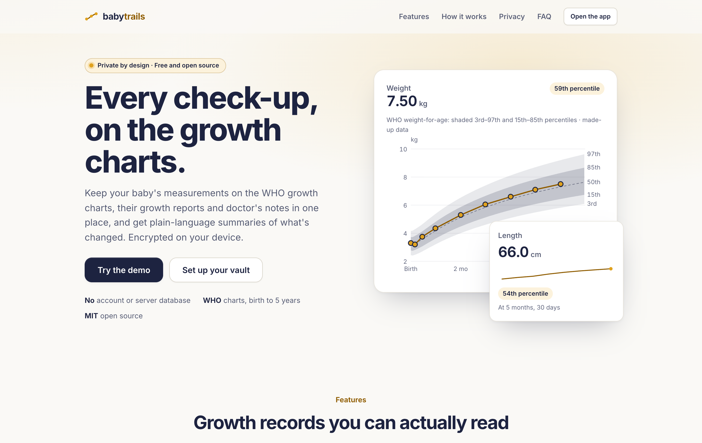
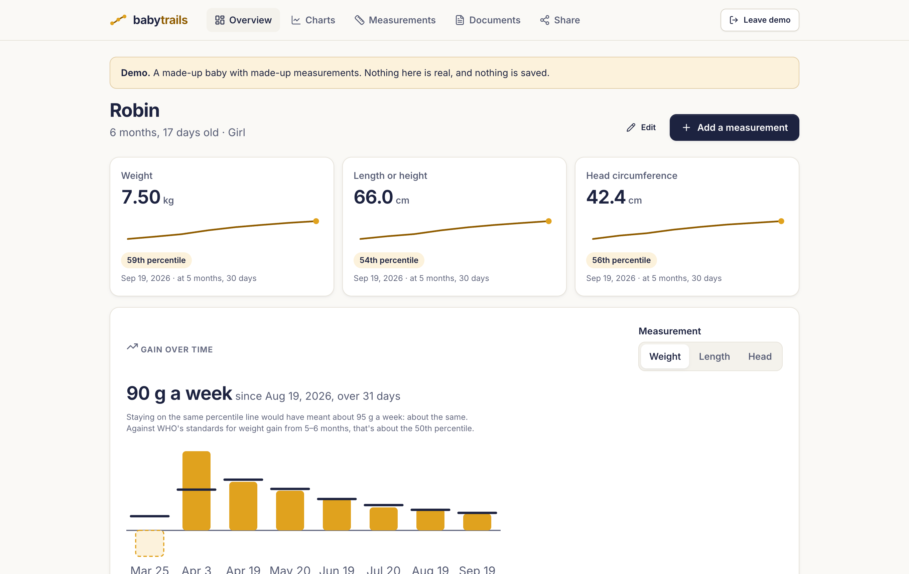
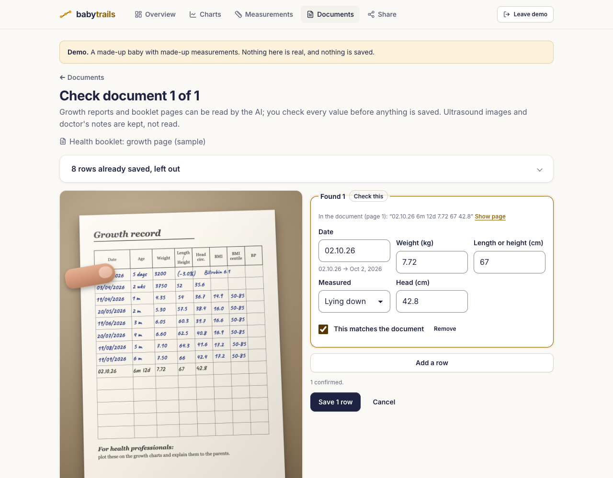
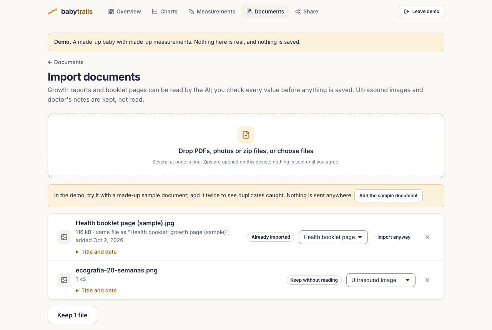
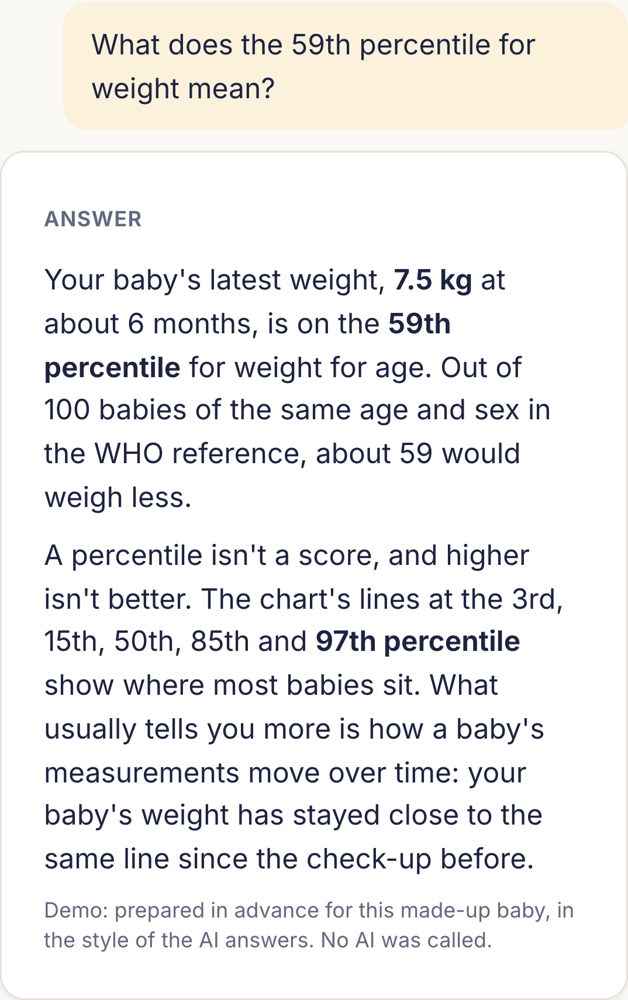
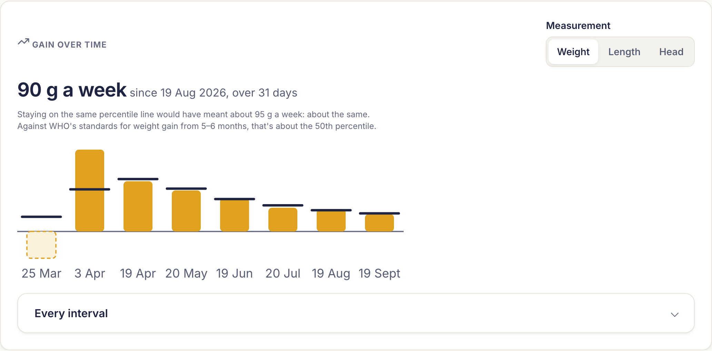
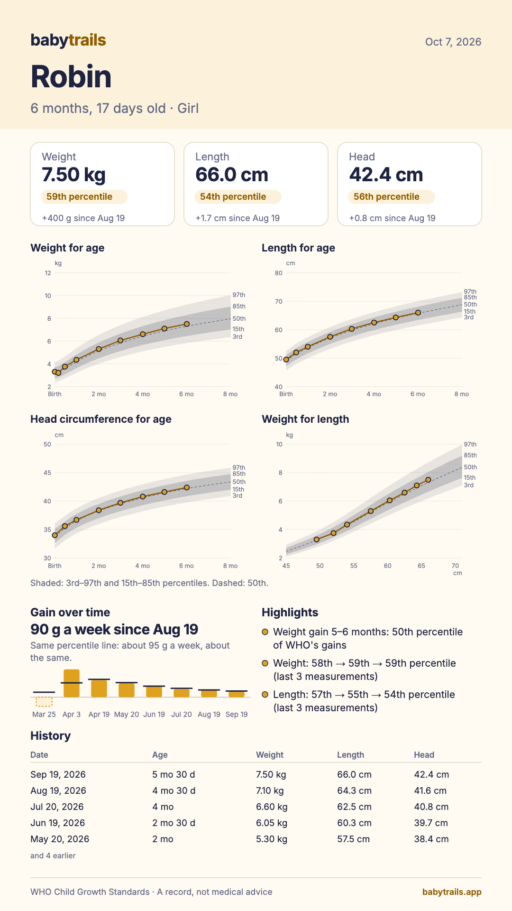
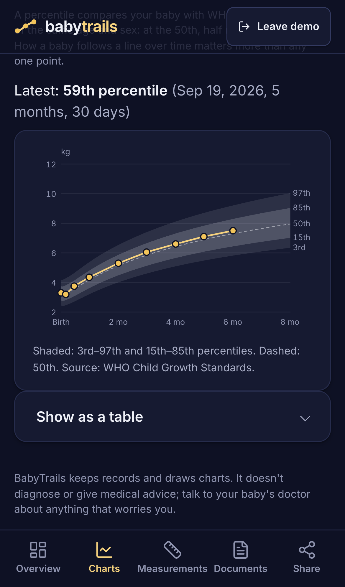

# BabyTrails: a baby's growth records, private by design

*Case study, October 2026, by [Thomas Butman](https://tbutman.com). BabyTrails is live at
[babytrails.app](https://babytrails.app) and in active development. Free and open source (MIT).
Code: [github.com/tbutman/babytrails](https://github.com/tbutman/babytrails). Screenshots show the
demo; every name, value and document in them is made up.*

  

## The problem

My son's growth records lived in a months-long chat with an AI assistant. At every check-up I sent a
photo of the same page of his health booklet, with new rows added; between check-ups I asked what the
numbers meant, whether a home measurement was even possible, whether a weekly gain was usual, and
what came next. It was useful, but hard to search, impossible to chart, and it kept a child's health
records in a chat history.

Reading it back, the useful parts were clear: one place for every visit, answers to the next
question, and a report worth sending to family. So were the fragile parts. The model worked out
numbers itself and sometimes got them wrong, a length I'd only floated as a what-if later
appeared as a recorded measurement, its charts were drawn by an image model and didn't match
the data, and "is this normal?" got reassurance rather than a reference. BabyTrails keeps the first
list and designs out the second. It is deliberately not a judgment on whether a baby is healthy:
that's the pediatrician's job.

## The decisions that shaped it

**Private by design, bring your own key.** The app is static files. Everything a parent enters or uploads is
encrypted in their own browser and never reaches my server: no accounts, no database, no analytics, no
cookies. AI is optional; when a parent uses it, their browser sends that one request straight to
Anthropic with their own API key, after a screen that lists what will and won't be sent. In the EU,
children's health data is special-category data under GDPR; not holding it at all is simpler and
safer than holding it well.

The trade-offs, stated in the app as plainly as here:
- **No password reset.** Lose the passphrase and the records are gone. Setup says so before you choose
  one.
- **Browser storage can disappear.** Safari deletes a site's data after 7 days without a visit unless
  it's on the Home Screen. The app asks for persistent storage, nudges iPhone users to install it, and
  reminds everyone to make an encrypted backup.
- **One device per vault.** Two parents can't share live records yet. Next, if people want it:
  encrypted sync between devices.
- **Bring your own key** is friction. The demo needs no key, and the AI features cost about one or two
  US cents each at current prices.

**The code computes; the AI explains; the parent confirms.**
- **The code computes.** Percentiles and z-scores come from WHO's LMS method, including WHO's
  adjustment beyond ±3 SD, tested against WHO's published values. Gains, references and the "worth
  mentioning to your pediatrician" notes are all computed before the AI sees anything.
- **The AI explains.** Summaries and answers are written from a facts object the code builds, with no
  name, no date of birth and no dates at all: ages are in days.
- **The parent confirms.** Reading a document, the AI only copies values as printed into a strict
  schema, with the text it read and a confidence level. Every value is shown next to the page, and
  nothing is saved until the parent ticks it. Units are converted by code, not the model.

It never says whether a baby is healthy, never interprets ultrasound images (they're stored and shown
only), and every AI output is labeled.

  

## Reading the booklet, again and again

A Portuguese health booklet's growth page is photographed again at every check-up, with every earlier
row still on it. That turned out to be the main way a parent adds records, so the import is built
around it:

- **Several files or zips at once,** opened in the browser with caps on file count and unpacked size.
- **A kind for each file,** guessed from its name in English or Portuguese ("ecografia" is an
  ultrasound, "boletim" a booklet page). Ultrasound images and doctor's notes are kept without being
  read.
- **Duplicates caught at every level.** The same file is recognized by its SHA-256 fingerprint before
  anything is sent to the AI. After reading, rows already saved are left out, and only the new ones
  go to review. An early version called a re-photographed page "a report you already added" and
  offered to skip it, which would have dropped the new rows; walking through a real booklet page
  photographed three times caught it.
- **Photos of one document,** such as both pages of a booklet spread, grouped in page order, read
  together and checked once, so a table that runs across pages comes back as one.
- **The page's own dates decide the date order.** A single new row dated "02.10.26" is read day first
  because the saved rows on the same page show it, so the parent isn't asked.

Real booklet pages never go into the repository, screenshots or demo. A script draws made-up
look-alikes instead, in handwriting fonts and as "photos", with the same hard cases: grams and
kilograms on one page, a decimal comma, a weight-change note in the length column, a non-growth note
across other columns, a two-digit year, a date under a thumb. The demo reads an English one; the tests
import a Portuguese one three times.

  
  

## Answering the next question

**Gain over time, with references instead of reassurance.** Weight gain per week and length and head
gain per month between every pair of measurements, each next to two references computed from WHO
data: the gain that would have kept the same percentile over the same days, and, when the two
measurements line up with one of WHO's 1- or 2-month intervals, where the gain falls among WHO's own
weight velocity standards. "Is 90 g a week usual?" becomes "about the gain that keeps the same line,
and about the 50th percentile of WHO's gains for 5 to 6 months".

**Ask about the numbers.** Free-form questions, answered from the facts object, in saved, encrypted
conversations. The rule is that answers use only numbers the code computed. The AI must declare every
number it writes, with the path of the fact it came from (`gains.weight[5].perWeekGrams`); the code
resolves each one, compares the value at the precision written, rejects any other measurement number
in the text and any reassurance ("healthy", "normal"), and retries once with the problems before
withholding the answer. Questions about illness get a fixed pointer to the pediatrician. A typed
name is replaced before anything is sent. The module is generic, and LabTrails uses it too.

**Second looks and doubt.** A value far off the chart for the age, a length smaller than last time or
a big jump in a short time gets a gentle "measure again?", and values beyond WHO's own implausible
limits need a second tap. Each measurement records where it was taken (home measurements are open
circles on the charts), and a doubtful one can be left out of charts and summaries without deleting
it. For newborns, weight change from birth weight and the day it was regained, with NICE's
thresholds (more than 10% lost, or not back by 3 weeks) flagged as worth mentioning, and charts in
weeks for the first three months.

  
  

## A report card to share

The chat made a "Baby Growth Report" infographic whose charts didn't match its own table. BabyTrails'
report card is drawn by code from the saved data, so every number and point is exact: the latest
weight, length and head with percentiles and the change since the last check-up, four WHO charts, gain
over time, the history and a few highlights written from templates (no AI needed). It saves as a
phone-sized image for messaging apps or an A4 PDF, with the name, a nickname or no name.

  
  

## Security design

- **Encryption:** a random 256-bit data key encrypts every record and file with AES-256-GCM. It's
  wrapped by a key derived from the passphrase with Argon2id (PBKDF2 where WebAssembly can't run), and exists in memory only as a
  non-extractable WebCrypto key while unlocked. Each record is bound to its collection and ID, and each
  file chunk to its position, so tampered or shuffled data fails to decrypt instead of showing
  something wrong.
- **Network:** a strict Content-Security-Policy allows requests only to the app and Anthropic's API.
  Every browser test fails if the app requests any other origin. Fonts, icons, pdf.js and its decoders
  are self-hosted; there are no third-party scripts.
- **AI output is untrusted:** it's rendered as a small Markdown subset by my own code, never as HTML,
  and a test feeds it `<script>` and `` to prove it.
- **The WHO data stays out of the repository.** WHO's growth and velocity tables are downloaded at
  build time and checked against pinned SHA-256 checksums, because their license doesn't fit the
  MIT-licensed code.
- **Honest limits** are in the [threat model](../THREAT_MODEL.md): a compromised device, a malicious
  deployment (the CSP limits mistakes, not someone who controls the code), and the AI provider seeing
  what the parent chooses to send.

## Two apps, one core, two agents

BabyTrails was built alongside a sister app, [LabTrails](https://labtrails.app) (blood test results
over time), by two AI coding agents working in parallel, which I directed and reviewed. They share a
core in `src/core/`: the encrypted vault, storage, backup, documents with an in-app PDF viewer, the
review screen, the AI client, a design system, the import flow, and now the question-answering
module, with nothing growth-specific in it. Ownership was explicit: BabyTrails' agent owned the core,
and LabTrails' agent wrote some shared pieces first (the design system and the import), which then
moved into the core. The agents coordinated through a shared notes file of proposals, requests and a
log, with me deciding anything that affected both apps.

**A design system, not a theme.** Both apps use one kit: Inter throughout, Lucide icons, one accent
per app (honey for BabyTrails), a tab bar on phones, metric cards with sparklines, and a landing page
each from the same template. A unit test checks every color pairing against WCAG 2.1 in both themes;
it ruled out the honey text first proposed, at 4.47:1 on one surface, below the 4.5:1 minimum.

## Shipping and what broke

BabyTrails is served as static files from my home server through an outbound-only Cloudflare Tunnel.
The server pulls builds that CI published as GitHub releases and checks each checksum, so no workflow
holds server credentials, and nothing on the internet can reach the server directly. There's no access
log. Going live surfaced real problems, each now guarded:

- **PDFs wouldn't open.** The PDF viewer's worker was served with the wrong type (nginx has no entry
  for `.mjs`). CI now serves every build through the server's own nginx config, in the pinned image,
  and checks every file's type and the security headers.
- **Returning visitors kept the old version** after a deploy, because the new offline worker waited
  for every tab to close. BabyTrails shows a Reload banner instead of switching by itself, which would
  lock the vault and drop anything being typed. LabTrails adopted the same banner.
- **A cached 404 could break the app.** Long-lived cache headers were sent on 404s too, so Cloudflare
  could keep a 404 for a new build's file requested a moment before it was installed. Missing files
  are now served `no-store`, and CI checks a missing file in every cached location.
- **Deploys stalled on GitHub's rate limit.** Three sites' deploy timers made about 90 unauthenticated
  API requests an hour against a limit of 60 (an unchanged 304 still counts). The shared deploy script
  now reads the newest release from github.com's redirect instead of the API.
- **A backup test failed now and then.** A false positive: it checked that the encrypted backup didn't
  contain a four-letter name, and a megabyte of random base64 occasionally does.

## What was tested

- **198 unit tests in 25 files**: WHO maths against published values and table edges, including the
  velocity tables; encryption round trips, wrong passphrases and tampering; passphrase rules, the
  PBKDF2 fallback, tabs locking together and erasing the vault; backups; the review rules; gains and
  their references; the newborn rules and NICE's flags; babies born early; what's worth mentioning;
  the second looks; the report card's numbers matching the app's; the answer check (matching facts,
  signs, undeclared numbers, banned phrases, retries, the demo's prepared answers); the AI client,
  refusals and offline errors; summary facts without names or dates; zips, duplicates and file
  kinds; and color contrast.
- **37 browser tests** against the production build with its CSP, every one failing if the app
  contacts any site other than itself: the demo, a full vault flow, changing the passphrase,
  restoring a backup, erasing the vault, tabs locking together, returning to the same screen after a
  lock or reload, installing and opening offline, the Reload banner, a newborn's first weeks,
  doubtful measurements, typed units, the report card in both formats, charts as a table, axe
  accessibility checks, the same booklet page imported three times, and, with a mocked Anthropic API,
  that nothing is sent before the parent agrees, the name and dates never appear in a request, only
  ticked values are saved, a planted value can't be saved, and an answer with unchecked numbers is
  withheld.
- **CI** runs lint, typecheck, the tests, the build and the nginx check on every pull request and
  every push to `main`.

Not yet tested: real phones (iPhone Safari, Android Chrome) with real health booklets, which only I can
do, with my son's records in my own browser.

## What's next

- Corrected age for babies born early, until 24 months. For now the weeks of pregnancy at birth are
  recorded, and the app says its percentiles use age from birth.
- Testing with our own records.
- CDC charts from 2 years, and WHO's length and head increments.
- Later: visits and vaccinations, a Portuguese interface and, if it's worth building, encrypted sync
  between parents' devices.

## How it was built

With an AI coding agent (Claude), from a written brief and a spec I reviewed and approved before any
code, then in steps I approved one by one, each a pull request: the first version, the shared design
system, the shared import, and a second spec, written after comparing the app with the chat that
inspired it, which added gains and references, the report card, the first weeks, second looks, the
look-alike booklet pages and "Ask about the numbers". All of it was started and went live on
October 6, 2026. The commits say so.
